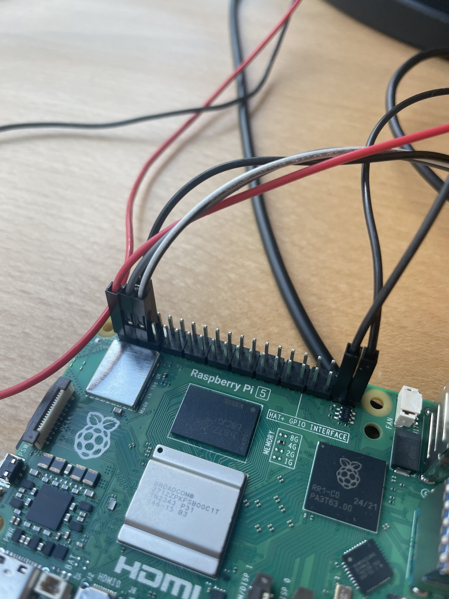

# Step-by-Step Guide for Replication

-----------------------------------------------------------------------
## Overview
-----------------------------------------------------------------------
This guide is a step-by-step walkthrough designed to make it easy to 
replicate and understand the project. It provides detailed instructions
for setting up both the hardware and software components involved in 
building the autonomous RC car system.

This guide covers:
- Required hardware and wiring
- Environment setup (on both the Pi and the laptop)
- Running the main scripts
- Common issues and troubleshooting tips
- Tips on hardware that could be exchangable for an easier build

By the end of this guide, you should have a working system capable of:
- Detecting ArUco markers from an overhead camera
- Monitoring proximity to a taped border
- Controlling an RC car in real-time via manual or automated logic

-----------------------------------------------------------------------
## Table of Contents
-----------------------------------------------------------------------
- [Required Components](#required-components)
- [Tips for an Upgraded Approach](#tips-for-an-upgraded-approach)
- [Chassie build](#chassie-build)
- [Connecting Inputs to PCA9685](#connecting-inputs-to-pca9685)
- [Connecting Outputs from PCA9685](#connecting-outputs-from-pca9685)
- [Motor Connections](#motor-connections)
- [Software Setup Pi](#software-setup-pi)
- [Software Setup for External Computer](#software-setup-for-external-computer)

-----------------------------------------------------------------------
## Required Components
-----------------------------------------------------------------------
To complete this project, you’ll need the following:

### Core Components
- **Raspberry Pi 5**
- **64GB Micro SD card**
- **XRAY M18 PRO chassis**
- **Hobbywing QuicRun Fusion Mini 16** (2-in-1 ESC + motor combo)
- **LiPo battery** for motor (2S or 3S, 7.4–11.1V, EC2 connector)
- **Power supply** for Raspberry Pi and PCA9685 (e.g., 5V 5A USB-C)
- **PCA9685 16-channel PWM driver board**
- **Printed ArUco marker** (attached to the RC car)
- **USB webcam** (mounted overhead — 720p or better recommended)

### Wiring & Connectors
- 4× **female-to-female jumper wires** (Pi to PCA9685 I2C)
- 2× **male-to-female jumper wires** (motor signal + ground to Pi)

### Peripherals for Pi Setup
- **Monitor** (with HDMI input)
- **HDMI to mini-HDMI cable** (for monitor connection)
- **USB keyboard and mouse** (or wireless combo)
- **Internet access** (Wi-Fi or Ethernet)

### Tools & Accessories
- **Multimeter** (to verify voltage and continuity)
- **Soldering iron** (for solid, permanent connections if needed)
- **Zip ties** or **double-sided tape** (to secure components)
- **SD card reader** (for flashing the Raspberry Pi OS)
- **Small screwdriver set**
- **Printer** (for printing ArUco markers at correct scale)

-----------------------------------------------------------------------
## Tips for an Upgraded Approach
-----------------------------------------------------------------------
The servo does **not perfectly align** with the pre-drilled holes in 
the chassis base. Other servos could fit better to this chassis and 
therefore sit more secure. 

The motor is **too large** for the standard motor slot located on the
left side of the chassis. The motor's EC2 cable adapter doesn't match
the battery adapter used in this project. The gears included with the
chassis do not fit the motor’s pinion shaft.

Either swap out the motor for a one that fits the requirements on the
other components. Or swap out only the battery to be able to skip the 
wire replacement.
-----------------------------------------------------------------------
## Chassie build
-----------------------------------------------------------------------
The **XRAY M18 PRO** is delivered as a disassembled chassis and must be
assembled before use. A simple step-by-step assembly guide is included 
in the box and should be followed for basic construction.

### Servo Mounting
To mount it securely:
- Use the **servo foot with one screw hole and a pin** on one side.
- Use the **perpendicular bracket** on the opposite side.

This combination allows a stable and functional mounting, even if not 
perfectly symmetrical.

### Motor Fitment

### Gear Compatibility
Use the gear specified under [Required Components](#required-components), 
as it is compatible with the motor.

-----------------------------------------------------------------------
## Input to PCA9685
-----------------------------------------------------------------------
Use 4 female-to-female jumper wires to connect the PCA9685 to the
Raspberry Pi 5.

### PCA9685 to Raspberry Pi 5 (I2C Wiring):

- **GND** → Ground (Pin 6 on Pi)  
- **SCL** → SCL (Pin 5 on Pi)  
- **SDA** → SDA (Pin 3 on Pi)  
- **VCC** → 3.3V (Pin 1 on Pi)

### 5V Power Distribution

The PCA9685 also needs a separate 5V power input connected through
its screw terminal block. Connect it as follows:

- **Red (V+)** → Left screw terminal (positive side)  
- **Black (GND)** → Right screw terminal (ground)

Reference image:

-----------------------------------------------------------------------
## Output from PCA9685
-----------------------------------------------------------------------
Connect a 3-wire cable to the first PWM output channel on the PCA9685. 
Make sure to align the wires according to their color so that each 
signal is properly routed.

### Wire Color Matching:
- **Yellow → Yellow** (Signal)  
- **Red → Red** (Power)  
- **Black → Black** (Ground)

-----------------------------------------------------------------------
## Motor connections
-----------------------------------------------------------------------
You will need 2 male-to-female jumper wires.

The **Hobbywing QuicRun Fusion Mini 16** requires a power source of
**7.4V (2S Li-Po)** to **11.1V (3S Li-Po)**. Connect your battery to
the motor via the **blue EC2 connector**.

Since the motor draws power directly from the external battery, it does
**not** require power from the red V+ (power) wire on the PCA9685. It
only needs:

- A PWM **signal**
- A shared **ground** with the rest of the system

Leave the **red wire unconnected** when wiring the signal output.

### Wiring Instructions:
- Connect the signal wire to **GPIO 26 (Pin 37)** on the Raspberry Pi  
- Connect the ground wire to **Ground (Pin 39)** on the Raspberry Pi

Reference image:

------------------------------------------------------------------------
## Software Setup Pi
------------------------------------------------------------------------

1. Flash the SD card with Raspberry Pi OS using an external computer.
2. Insert the SD card and power the Raspberry Pi 5.
3. Connect a monitor, keyboard, and mouse to the Pi.
4. Boot the Pi and follow the initial setup wizard.
5. Connect to Wi-Fi or use an Ethernet cable.
6. Open a terminal and run the following:

git clone 
https://github.com/Cyber-physical-Systems-Lab/AutonomousCarGuide.git
cd AutonomousCarGuide/Client

sudo raspi-config
Here we need to enable I2C by clicking:
- 3: Interface Options
- I5: I2C 
Would you like the ARM I2C interface to be enabled?
<Yes>

sudo apt-get update
sudo apt-get install python3-pip python3-dev i2c-tools

Now we need to download and install all dependencies. 
pip3 install adafruit-blinka adafruit-circuitpython-servokit --break-system-packages

Go into the client_steering.py file and change the server IP-adress to
the adress of the external computer that is being used as server.

------------------------------------------------------------------------
## Software Setup for External Computer
------------------------------------------------------------------------

pip install cv2

git clone 
https://github.com/Cyber-physical-Systems-Lab/AutonomousCarGuide.git
cd AutonomousCarGuide/Server

